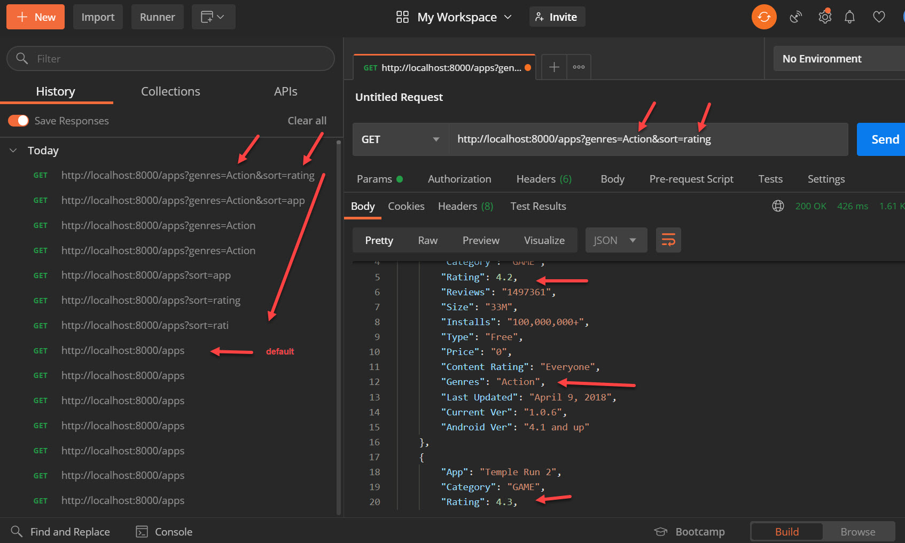

## >> App Name:

Goggle-Play-App--Express-server

## >> APP Summary:

This project builds an Express server with a GET endpoint /apps, the source of the data is from a local database. By default(just the /apps endpoint) it will return the complete list of apps in the 'Database' 

The endpoint also accepts the  2 optional query parameters:

-> Parameter # 1 : Sort=
* app
* rating

-> Paramater # 2 (fiter) : genres=
* Action
* Arcade
* Card
* Casual
* Puzzle
* Strategy

Note that the case of the parameter keys and values does not matter.

-> Some Sample Endpoints

http://localhost:8000/apps

http://localhost:8000/apps?sort=app	

http://localhost:8000/apps?sort=rating

http://localhost:8000/apps?genres=Action

http://localhost:8000/apps?genres=Casual

http://localhost:8000/apps?genres=Action&sort=rating

## >> Screenshot 

## >> Technologies used in this APP:
* Express Server
* app.get API
* Express middleware - (CORS) - Cross-Origin Resource Sharing 

-> Javascript: ES6

-> Tools
* Postman
* VSC Debugger
* nodemon 
* NPM
* morgan loggging tool

## >> [Github Link](https://github.com/davetam88/Noteful-App--React-Assignment)
